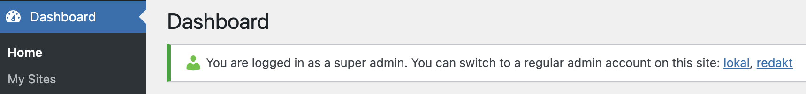

# Super Admin Switch to Admin

If you are logged in as a super admin, this plugin allows you to switch to a regular admin account on the current site. It lists all admins for the current site, except for the super admin, and creates a linked list in the admin notices.



## Prerequisites

- WordPress Multisite
- [User Switching](https://wordpress.org/plugins/user-switching/) plugin
- The subsite must have at least one regular admin account.

## Installation

- **Quick Install**

   - Download [`super-admin-switch-to-admin.zip`](https://github.com/soderlind/super-admin-switch-to-admin/releases/latest/download/super-admin-switch-to-admin.zip)
   - Upload via WordPress Network > Plugins > Add New > Upload Plugin
   - Network activate the plugin.

- **Composer Install**

   ```bash
   composer require soderlind/super-admin-switch-to-admin
   ```

- **Updates**
   * Plugin updates are handled automatically via GitHub. No need to manually download and install updates.


## Changelog

### 1.0.5
- Hotfix: Add missing class for plugin updater.

### 1.0.4
- Add plugin updater.

### 1.0.3

- Exclude all super admins from the list of admins.

### 1.0.2

- Add Norwegian translation.

### 1.0.1

- Add a screenshot.

### 1.0.0

- Initial release

## Copyright and License

Super Admin Switch to Admin is copyright 2023 Per Soderlind

Super Admin Switch to Admin is free software: you can redistribute it and/or modify it under the terms of the GNU General Public License as published by the Free Software Foundation, either version 2 of the License, or (at your option) any later version.

Super Admin Switch to Admin is distributed in the hope that it will be useful, but WITHOUT ANY WARRANTY; without even the implied warranty of MERCHANTABILITY or FITNESS FOR A PARTICULAR PURPOSE. See the GNU General Public License for more details.

You should have received a copy of the GNU Lesser General Public License along with the Extension. If not, see http://www.gnu.org/licenses/.

This plugin is licensed under the GPL-2.0+ License. See the [LICENSE](LICENSE) file for more information.
